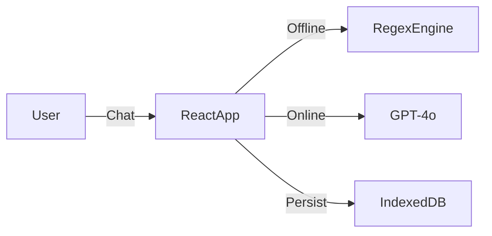

# Session Co-Pilot 🧩

An **Offline-First** AI assistant for ABA (Applied Behavior Analysis) therapists to log session data comfortably and accurately.

## 🚀 Features
-   **Natural Language Logging:** "He had 2 tantrums and an elopement (30s) after I took the iPad." -> Parsed automatically.
-   **Offline-First:** Built with [Dexie.js](https://dexie.org/) (IndexedDB). Works completely without internet.
-   **Hybrid AI:** Uses **GPT-4o-mini** (GitHub Models) when online, falls back to **Logic Engine** when offline.
-   **Smart Hints:** Asks for missing context (Antecedents, Functions, Interventions) only when needed.
-   **Safety First:** Dedicated "Oh Crap" button for reporting critical incidents.
-   **Multi-User Authentication:** JWT-based auth with role-based access control (Manager, BCBA, RBT, Parent).
-   **Cloud Sync:** Cosmos DB integration for syncing session data across devices.
-   **Organization Management:** Supports multiple organizations with learner assignments and permissions.

## 📐 Architecture

For deep dive, see [Architecture Guide](architecture.md), [Agent Guide](agents.md), and [Payment Plan](pay_plan.md).

## 🛠️ Tech Stack
-   **Framework:** React 18 + Vite (TypeScript)
-   **Routing:** React Router
-   **PWA:** Service Workers for offline caching (`vite-plugin-pwa`)
-   **State:** Zustand + React Context (Auth)
-   **Database:** Dexie.js (Client-side IndexedDB)
-   **LLM:** GitHub Models API (OpenAI SDK compatible)
-   **Backend:** Azure Functions (Node.js)
-   **Cloud Database:** Azure Cosmos DB
-   **Hosting:** Azure Static Web Apps

## 🏃‍♂️ Getting Started

### Prerequisites
-   Node.js 18+
-   npm

### Installation
1.  Clone the repo
    ```bash
    git clone https://github.com/warrofua/session-copilot-kv7.git
    cd session-copilot-kv7
    ```
2.  Install dependencies
    ```bash
    npm install
    ```
3.  Set up Environment
    Create a `.env` file:
    ```env
    VITE_GITHUB_TOKEN=gho_your_token_here
    VITE_COSMOS_CONNECTION_STRING=your_cosmos_connection_string_here
    ```
4.  Start Development
    ```bash
    npm run dev
    ```
    For local API testing:
    ```bash
    cd api && npm install && npm start
    ```
5.  Run Tests
    ```bash
    npm test
    ```

## 🧪 Testing
The project uses **Vitest** for unit testing, focused on the offline logic engine.
-   **Unit Tests:** Located in `src/services/llmService.test.ts`. Covers regex parsing for behaviors, durations, and skill trials.
-   **CI/CD:** Tests run automatically on every push via GitHub Actions.
-   **Mocking:** `src/test/setup.ts` mocks `localStorage` and `fetch` to simulate offline conditions.

## 📦 Deployment (Azure)
This project is configured for **Azure Static Web Apps** with Azure Functions backend.
-   **CI/CD:** Commits to `master` automatically trigger a build/deploy via GitHub Actions.
-   **Secrets:** Set `VITE_GITHUB_TOKEN` and `VITE_COSMOS_CONNECTION_STRING` as GitHub Repository Secrets.
-   **API:** Azure Functions in `api/` directory automatically deploy with the Static Web App.

## 📱 Architecture
The database lives in the **Browser** (IndexedDB) for offline-first operation. Azure hosts static assets and provides:
-   **Authentication API:** JWT-based login/register via Azure Functions
-   **Cloud Sync:** Cosmos DB syncs local data when online
-   **SyncQueue:** Dexie.js table tracks pending changes for background sync
