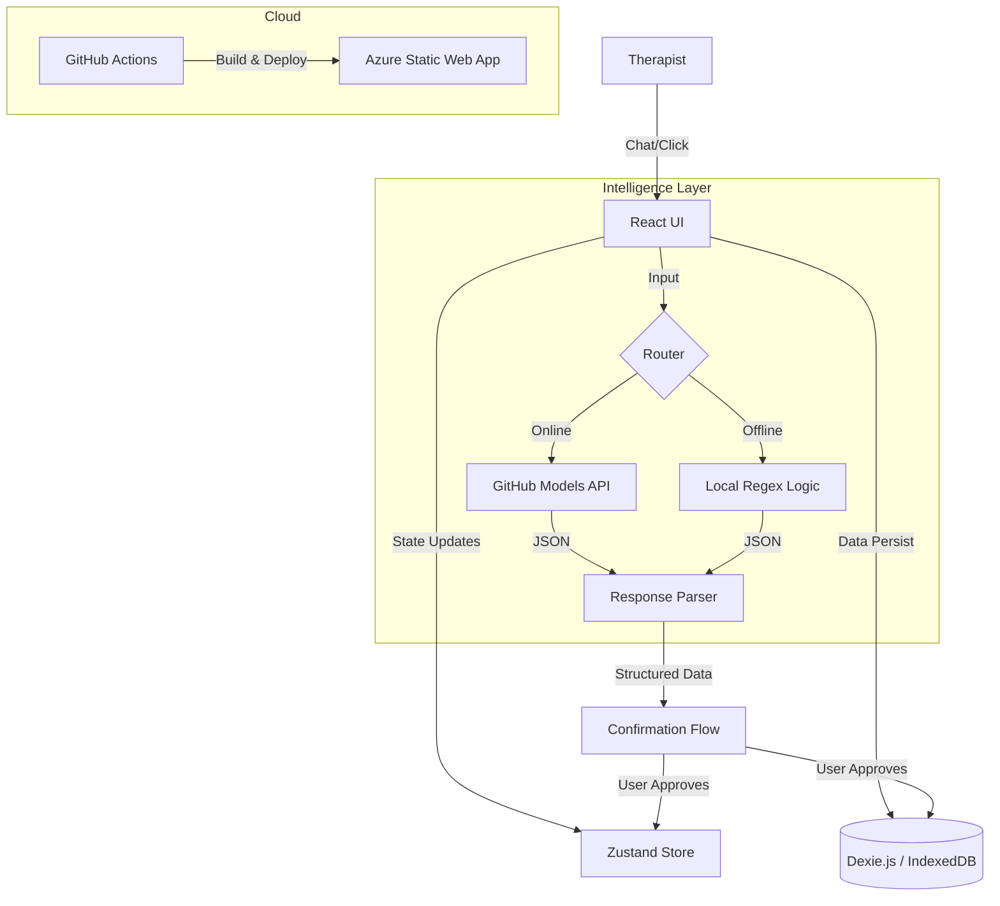

# Session Co-Pilot Architecture 🏗️

## High-Level Overview

Session Co-Pilot is an **Offline-First**, **Client-Side** web application designed for ABA (Applied Behavior Analysis) therapists. It prioritizes data integrity, speed, and reliability in environments with poor or no internet connectivity.

The architecture follows a **"Local-First"** (or Offline-First) pattern, where the browser's IndexedDB is the primary source of truth, and the cloud is purely for backup/sync (future state) and AI processing (when available).

## System Diagram

## Component Breakdown

### 1. Frontend Layer (React + Vite)
-   **Framework:** React 18 with TypeScript.
-   **Build Tool:** Vite (fast HMR, strict ESM).
-   **Styling:** Vanilla CSS variables (Design Tokens) for a lightweight, maintainable theme system.

**Key Components:**
-   `App.tsx`: The main controller integration point.
-   `ChatArea.tsx`: Handles message rendering and "Chat Bubble" UI.
-   `SideDrawer.tsx`: The "Session Summary" view (Read-Model of the data).
-   `llmService.ts`: The interface for all "Intelligence" operations.

### 2. State Management (Zustand)
We use **Zustand** for transient UI state and in-memory data mirroring.
-   `sessionStore.ts`: Holds the *current* session's active data (events, trials, draft notes). This allows for instant UI reactivity without querying IndexedDB on every render.
-   `syncStore.ts`: Tracks online/offline status and pending sync counts.

### 3. Data Layer (Dexie.js / IndexedDB)
This is the **Core** of the application.
-   **Library:** Dexie.js (Wrapper for IndexedDB).
-   **Tables:**
    -   `behaviorEvents`: Time-series data of behaviors (timestamp, duration, antecedent).
    -   `skillTrials`: Education trial data (skill, target, response).
    -   `incidents`: High-priority safety reports.
    -   `syncQueue`: (Future) Outbox pattern for syncing data to cloud when online.
-   **Persistence:** Data survives tab closes, browser restarts, and offline periods.

### 4. Intelligence Layer (Hybrid)
We use a **Fallback Strategy** for AI:
1.  **Attempt Online:** valid `VITE_GITHUB_TOKEN` exists? -> Call GitHub Models API (GPT-4o-mini).
2.  **Fallback Offline:** Token missing or Network Error? -> Run `mockParseInput` (Regular Expressions).
    -   *Note:* The Regex engine has been robustly tuned to handle standard ABA terminology ("elopement", "SIB", "trials", durations).

### 5. Infrastructure (Azure)
-   **Host:** Azure Static Web Apps (Free Tier).
-   **CI/CD:** GitHub Actions automatically builds and deploys on push to `master`.
-   **Security:** API Tokens are injected at build time via GitHub Secrets. No secrets are stored in the repo.

## Data Flow
1.  **Capture:** User types "Patient ran away for 5 mins".
2.  **Process:** `llmService` parses text -> `{ type: 'elopement', duration: 300 }`.
3.  **Confirm:** UI shows "Logging: Elopement (300s). Correct?".
4.  **Persist:** On "Yes" -> Write to DexieDB -> Update Zustand -> Update UI.
